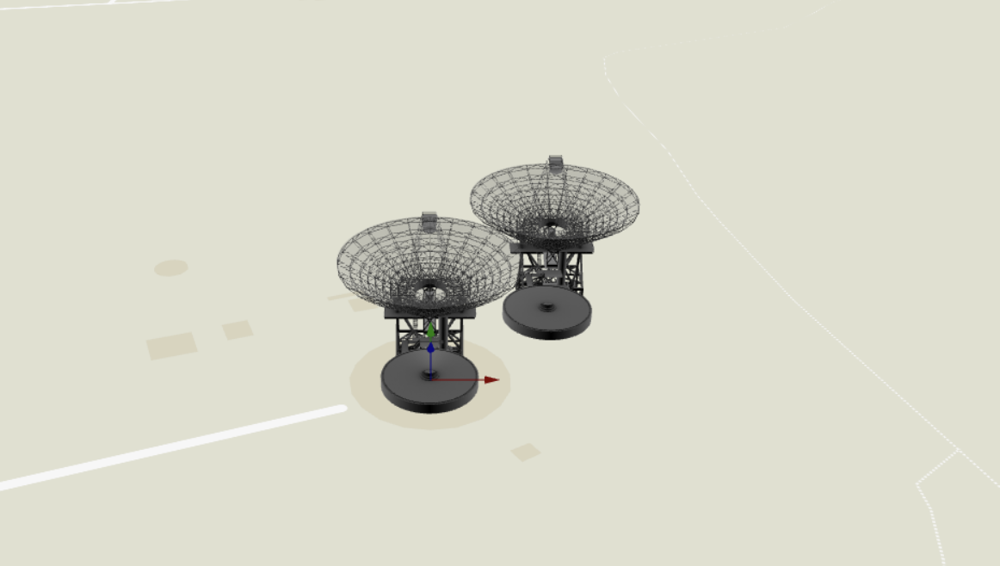

# MapLibre-GPU-js

## 项目简介
本项目基于开源项目 [MapLibre-gl-js](https://github.com/maplibre/maplibre-gl-js) 和 [Babylon.js](https://www.babylonjs.com/) 的实验性尝试。将 MapLibre-gl-js 的底层 WebGL 渲染内核替换为 WebGPU，以利用 WebGPU 现代图形 API 特性。提供个人学习和研究，部分 MapLibre-gl-js 的功能尚未完全实现。

## 功能特性
- **WebGPU 渲染**：使用 WebGPU 替代 WebGL。
- **兼容 MapLibre API**：保持与 MapLibre-gl-js 相同的 API 接口。
- **基于 Babylon.js**：利用 Babylon.js 的 WebGPU 支持，简化 WebGPU 渲染管线的实现。


## 快速开始
**安装依赖**
```
npm install
```
**构建开发版本**
```
npm run build-dev
```
**启动服务**
```
npm run start-server
```
**访问示例页面**
```
http://localhost:9967/test/examples/add-3d-model-babylon.html
```


## 关于
本项目基于 [MapLibre-gl-js](https://github.com/maplibre/maplibre-gl-js) 和 [Babylon.js](https://www.babylonjs.com/)，遵循 [MapLibre 许可](LICENSE.txt) 和 [Apache-2.0 许可](license.md)。
